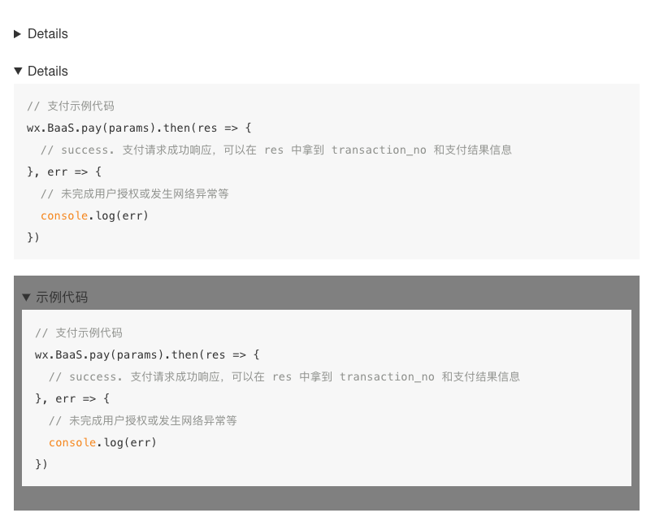

# 功能介绍

## 生成可折叠内容

### 使用方式



一般用法：
<pre>

```js
// 支付示例代码
wx.BaaS.pay(params).then(res => {
  // success. 支付请求成功响应，可以在 res 中拿到 transaction_no 和支付结果信息
}, err => {
  // 未完成用户授权或发生网络异常等
  console.log(err)
})
```

</pre>

默认打开:
<pre>

```js
// 支付示例代码
wx.BaaS.pay(params).then(res => {
  // success. 支付请求成功响应，可以在 res 中拿到 transaction_no 和支付结果信息
}, err => {
  // 未完成用户授权或发生网络异常等
  console.log(err)
})
```

</pre>


默认打开，添加样式:
<pre>

```js
// 支付示例代码
wx.BaaS.pay(params).then(res => {
  // success. 支付请求成功响应，可以在 res 中拿到 transaction_no 和支付结果信息
}, err => {
  // 未完成用户授权或发生网络异常等
  console.log(err)
})
```

```
</pre>
