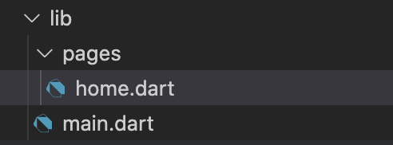

# Todo Demo 实战

现在我们会结合 SDK 来实战做一个 TODO APP 的一个小 demo。
构建这个 Demo 之前，我们先来看一下这个 demo 的最终效果。


以下是本次 Demo 教程的相关视频：

<div class="index-doc-header-video">
  <video src="https://cloud-minapp-287.cloud.ifanrusercontent.com/1kKuBds2vR67IvIP.mp4" controls="controls" playsinline=""></video>
</div>


## 准备

我们在正式开始之前，先捋一下准备工作。
构建这一个 Todo App，我们需要三步走：

1. 构建基本结构和样式；
2. 引入知晓云的 SDK；
3. 对 Todo 数据进行增删查改。


## 构建基本结构和样式

1. ### 准备工作


首先我们先在 lib 文件夹新建一个 pages 文件夹并在该文件夹里创建一个 home.dart 文件作为我们的首页。



然后在 home.dart 这个文件里，创建一个 stateful widget, 添加引入 material 库。

```dart
import 'package:flutter/material.dart';
 
class HomePage extends StatefulWidget {
 @override
 _HomePageState createState() => _HomePageState();
}
 
class _HomePageState extends State<HomePage> {
 @override
 Widget build(BuildContext context) {
   return Container(
   );
 }
}
```

最后在 main.dart 中引入该页面即可。

```dart
import 'package:flutter/material.dart';
import './pages/home.dart';
 
void main() {
 runApp(MyApp());
}
 
class MyApp extends StatelessWidget {
 @override
 Widget build(BuildContext context) {
   return MaterialApp(
     title: 'Flutter Demo',
     home: HomePage(),
   );
 }
}
```


2. ### 构建基本结构

返回 home.dart 这个文件，在 build 的 return 处添加 Scaffold，并添加 AppBar 标题等信息。由于我们 Demo 的结构是纵向排列，因此我们直接用 Column 即可。为了让我们的按钮都能够撑开屏幕的宽度，可以设置 CrossAxisAlignment.stretch。目前代码：

```dart
class _HomePageState extends State<HomePage> {
 @override
 Widget build(BuildContext context) {
   return Scaffold(
     appBar: AppBar(
       title: Text('知晓云 Flutter SDK Demo'),
     ),
     body: Column(
       crossAxisAlignment: CrossAxisAlignment.stretch,
       children: [
        
       ],
     ),
   );
 }
}
```

接着我们开始写输入框。我们可以用 Form 以及 TextFormField 来创建一个输入框，并且通过构建一个 controller 来控制输入框的行为。最后，可以定义 decoration 值来实现类似于占位符的效果：

```dart
Form(
child: TextFormField(
controller: inputController,
   decoration: InputDecoration(labelText: '请输入 Todo 内容'),
       ),
)
```

下一步便是构建一个添加 Todo 的按钮。我们可以通过创建一个 RaisedButton 并指定按钮内容为“添加 Todo”。由于目前还没到需要确定点击时间的时候，因此 onPressed 这个功能可以暂时设置为一个无动作的函数。之后为了让按钮好看一点，我们可以把按钮的背景设置为蓝色，文字设置为白色，高度设置 50，并让按钮和输入框稍微有一点间距：

```dart
SizedBox(
  height: 5.0,
),
ButtonTheme(
  height: 50.0,
  child: RaisedButton(
    onPressed: () {},
    child: Text(
      '添加 Todo',
      style: TextStyle(color: Colors.white),
    ),
    color: Colors.blue,
  ),
),
```

接下来我们继续构建我们的 Todo 列表。首先，我们在写结构之前先定义好一些将会用到的假数据，方便接下来的样式调整。我们可以定义一个 todoList 列表，每个子项都包含两个字段，一个是 “name”，表示 todo 的名字，另一个是 “isDone”，用于判断这个 todo 是否已经完成。

```dart
List todoList = [
  {"name": "学习 SDK", "isDone": false},
  {"name": "开早会", "isDone": true},
];
```

之后我们继续写列表的结构。我们可以用 ListView 来创建一个列表项，其 children 属性循遍历 todoList 的内容。之后每个 child 里我们都用一个 Row 来表示，其 children 属性包含三样东西，分别是 todo 的名称，完成按钮和删除按钮。为了 todo 名称可以撑开剩余宽度，我们还可以使用 Expanded 这个 widget 进行撑开：

```dart
ListView(
  shrinkWrap: true,
  children: todoList.map((todo) {
    return Row(
      children: [
        Expanded(child: Text(todo['name'])),
        RaisedButton(
          onPressed: () {},
          child: Text(
            '完成',
            style: TextStyle(color: Colors.white),
          ),
          color: Colors.green,
        ),
        SizedBox(
          width: 5,
        ),
        RaisedButton(
          onPressed: () {},
          child: Text(
            '删除',
            style: TextStyle(color: Colors.white),
          ),
          color: Colors.redAccent,
        ),
      ],
    );
  }).toList(),
```

目前我们的基本结构已经完成，但还需要判断一下 todo 完成和未完成的状态样式。我们可以根据 isDone 来判断完成状态。如果已经完成，则将 todo 名称的样式置灰，并且加一条横线表示已完成。由于已经完成，完成按钮也无须显示：

```dart
Expanded(
  child: Text(
    todo['name'],
    style: TextStyle(
      color: todo['isDone'] == true
          ? Colors.black26
          : Colors.black,
      decoration: todo['isDone'] == true
          ? TextDecoration.lineThrough
          : TextDecoration.none,
    ),
  ),
),
if (todo['isDone'] == false)
  RaisedButton(
    onPressed: () {},
    child: Text(
      '完成',
      style: TextStyle(color: Colors.white),
    ),
    color: Colors.green,
  ),
```

至此，我们基本完成了本次 Demo 的样式结构。

## 引入知晓云 SDK

引入 SDK 的部分相对比较简单，我们先去 https://pub.dev/ 搜索 minapp，找到我们官方知晓云 SDK 的包。在 Installing 标签页，将 dependencies 中的 minapp 部分引入到我们项目根目录中的 pubspec.yaml 文件对应的部分：

```yaml
dependencies:
 flutter:
   sdk: flutter
 minapp: ^0.0.1-dev.1
```

上面代码块的版本号为 0.0.1-dev.1，该版本还是一个预览版本。相信您在看到这篇文章时已经是正式版本了。

安装依赖后，我们回到 main.dart，引入 SDK。并在 main 这个函数中，用我们的 ClientID 初始化我们的 SDK。该 SDK 可以在知晓云控制台的设置中找到。最后，也需要在 home.dart 中引入 SDK。

```dart
import 'package:flutter/material.dart';
import 'package:minapp/minapp.dart' as BaaS;
import './pages/home.dart';
 
void main() {
 BaaS.init('dce25a0b4fe0a5558b5');
 runApp(MyApp());
}
 
class MyApp extends StatelessWidget {
 @override
 Widget build(BuildContext context) {
   return MaterialApp(
     title: 'Flutter Demo',
     home: HomePage(),
   );
 }
}
```

至此，我们已完成对 SDK 的引入。


## 对 Todo 数据进行增删查改

在写 Todo 的增删查改功能前，我们先在知晓云控制台创建一个名为 todo_demo 的表，为了接下来更方便地展示，这个表暂时设置为所有人都可以读写。然后新建两个字段，第一个为类型为 string 的 “name” 字段，另一个为类型为 boolean 的 “isDone” 字段，默认为 false。


之后返回到 home.dart，添加一个 TableObject 变量，并指定表名为 todo_demo：

```dart
TableObject tableObject = new TableObject('todo_demo');
```

接下来我们正式开始对数据的新增查改。

首先先创建一个添加 Todo 的函数。这个函数需要获取用户输入的值，然后通过调用 tableObject 中的 create 方法，创建一条记录。之后通过记录中的 set 方法设定 “name” 字段中的值，也就是输入值。最后调用 save 方法发出请求保存数据。

```dart
 // 添加 todo
 void addTodo() async {
   TableRecord record = tableObject.create();
   record.set('name', inputController.text);
   try {
     await record.save();
   } catch (e) {
     print(e.toString());
   }
 }
```

知晓云对于数据库的新增和删改都需要用户登录才能正常使用，但由于之前我们在创建表的时候已经对表的权限放开，允许所有人都可以增删查改，因此我们只需要构建一个匿名登录的方法即可。最后还需要将这个匿名登录方法放到 initState 中执行一下：

```dart
 void anonymousLogin() async {
   try {
     await Auth.anonymousLogin();
     print('登录成功');
   } catch (e) {
     print(e.toString());
   }
 }
 
 @override
 void initState() {
   super.initState();
   anonymousLogin();
 }
```

接下来我们开始添加获取 Todo 列表的方法。我们创建一个 getTodoList 函数，通过 tableObject 中的 find 方法，获取表内所有的数据。然后对 todoList 进行赋值为 recordList.records。其中这个 records 是 SDK 封装好的数据类型，具体内容可参考官方文档。

```dart
 // 获取 todo 列表
 void getTodoList() async {
   try {
     TableRecordList recordList = await tableObject.find();
     setState(() {
       todoList = recordList.records;
     });
   } catch (e) {
     print(e.toString());
   }
 }
```

由于之前的 todoList 是假数据，现在需要移除一下。在第一步构建的结构也要对应修改，在 todo 后面添加 recordInfo：

```dart
Expanded(
  child: Text(
    todo.recordInfo['name'],
    style: TextStyle(
      color: todo.recordInfo['isDone'] == true
          ? Colors.black26
          : Colors.black,
      decoration: todo.recordInfo['isDone'] == true
          ? TextDecoration.lineThrough
          : TextDecoration.none,
    ),
  ),
),
if (todo.recordInfo['isDone'] == false)
  RaisedButton(
    onPressed: () {},
    child: Text(
      '完成',
      style: TextStyle(color: Colors.white),
    ),
    color: Colors.green,
  ),
```

最后为了更好的用户体验，我们也要把 getTodoList 这个方法放到 initState 中，且也要相应地，在 addTodo 这个方法中放入。这样每当我们添加 todo 时，就刷新一次 todo 列表。

```dart
 @override
 void initState() {
   super.initState();
   anonymousLogin();
   getTodoList();
 }
```

```dart
await record.save();
getTodoList();
```

之后，我们刷新一个页面即可看到真实数据。

接下来我们继续写完成按钮的操作。我们可以通过调用 tableObject.getWithoutData 来获取某条数据项，然后将这条数据的 isDone 设置为 true，表示已经完成，然后通过 update 方法发出请求更新数据。

```dart
 // 完成 todo
 void completeTodo(String id) async {
   TableRecord record = tableObject.getWithoutData(recordId: id);
   record.set('isDone', true);
 
   try {
     await record.update();
     getTodoList();
   } catch (e) {
     print(e.toString());
   }
 }
```

最后我们来完成一下删除功能。通过调用 tableObject 的 delete 方法，并传入 id，进行删除：

```dart
 // 删除 todo
 void deleteTodo(String id) async {
   try {
     await tableObject.delete(recordId: id);
     getTodoList();
   } catch (e) {
     print(e.toString());
   }
 }
```

我们也不要忘记每次构建一个函数，也要相应地将其绑定到我们的按钮时间当中：

```dart
RaisedButton(
  onPressed: () => deleteTodo(todo.id),
  child: Text(
    '删除',
    style: TextStyle(color: Colors.white),
  ),
  color: Colors.redAccent,
),
```

至此，我们的 todo app 已经顺利地完成。
