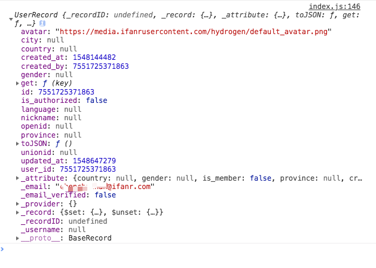

# currentUser

开发者可以调用 `BaaS.auth.currentUser()` 获取 `currentUser` 对象，通过该对象进而对当前用户进行管理。同时登录注册等接口也会返回 `currentUser` 对象。

## 获取 currentUser 对象

`BaaS.auth.currentUser()`

**示例代码**


```javascript
wx.BaaS.auth.currentUser().then(user => {
  // user 为 currentUser 对象
}).catch(err => {
  // HError  
  if( err.code === 604 ){
    console.log('用户未登录')
  }
})
```



若当前为未登录状态，则会抛出错误。

## currentUser 对象说明

currentUser 代表了当前登录的用户，开发者可以通过浏览 currentUser 上的字段来获取当前用户的信息，通过调用 currentUser 上的方法来更新用户信息。
该对象关联 `_userprofile` 表中 id 为当前用户 ID 的数据行。currentUser 字段包含了 `_userprofile`表的所有的*内置字段*，自定义字段可以通过 `currentUser.get(key)` 来获取。
内置字段说明请参考 [获取用户信息小节](./user.md)



### 获取用户自定义字段

开发者可能会在 _userprofile 表中定义一些自定义字段，要拿到这些自定义字段信息，可以通过如下两个 API 来获取：
- `currentUser.get(key)`
- `currentUser.toJSON()`

#### `currentUser.get(key)`

通过 `currentUser.get(key)` 可以获取用户单个自定义字段。

**示例代码**
假设开发者在 _userprofile 表中定义了 `custom_name` 列，并设置当前用户的 `custom_name` 为 `ifanrx`。则在 SDK 中查询当前用户自定义字段代码如下：
  
```javascript
BaaS.auth.currentUser().then(user => {
  console.log(currentUser.get('custom_name')) //  ifanrx
})
```

#### `currentUser.toJSON()`

可以通过 `currentUser.toJSON()` API，来获得一次性获取完整的用户信息。

**`currentUser.toJSON()` 返回示例**

```json
{
  "updated_at": 1547721935,
  "gender": null,
  "_username": "ifanrx",
  "_is_anonymous": null,
  "_email": "ifanrx@ifanr.com",
  "_provider": null,
  "nickname": null,
  "avatar": "https://media.ifanrusercontent.com/hydrogen/default_avatar.png",
  "unionid": null,
  "created_by": 6339469046395138,
  "id": 6339469046395138,
  "_password": "pbkdf2_sha256$36000$1Har5NnbfimH$oJ4bWae6NlAtNEWl65o+GOdYd5zP6WB2MZLTOYpTiPY=",
  "city": null,
  "created_at": 1547721935,
  "language": null,
  "is_authorized": false,
  "province": null,
  "openid": null,
  "_email_verified": true,
  "country": null
}
```

## 更新用户信息

`currentUser` 对象提供了一些方法，用于修改当前用户信息。

常见使用场景：
- 用户的用户名/邮箱设置有误，需要修改为新的用户名/邮箱。
- 用户使用小程序授权登录后，通过设置用户名或邮箱，以便下次通过用户名或邮箱登录。

### 更新用户名

`currentUser.updateUsername({username, password})`

**参数说明**

| 名称      | 类型           | 说明 |
| :------- | :------------  | :------ |
| username   | String  | 新用户名 |
| password      | String  | 密码 |

**示例代码**


```javascript
let currentUser = wx.BaaS.auth.currentUser()

currentUser.updateUsername({
  username: 'ifanrx_new',
  password: '111111',
}).then(user => {
  console.log(user)
}).catch(err=>{
  // HError
})
```


**返回结果说明**

user 为 currentUser 对象，该对象的说明见上文

err 对象结构请参考[错误码和 HError 对象](/js-sdk/error-code.md)


### 更新邮箱

`currentUser.updateEmail({email, password }, {sendVerificationEmail} = {})`

**参数说明**

| 名称      | 类型           | 说明 |
| :------- | :------------  | :------ |
| email      | String  | 新邮箱 |
| password      | String  | 密码 |
| sendVerificationEmail   | Boolean  | 是否发送验证邮件，可选，默认为 false |

**示例代码**


```javascript
let currentUser = wx.BaaS.auth.currentUser()

currentUser.updateEmail({
  email: 'ifanrx_new@ifanr.com',
  password: '111111',
}, {sendVerificationEmail: true}).then(user => {
  console.log(user)
}).catch(err=>{
    // HError
  })

```


**返回结果说明**

user 为 currentUser 对象，该对象的说明见上文

err 对象结构请参考[错误码和 HError 对象](/js-sdk/error-code.md)


### 更新密码

`currentUser.updatePassword({password, newPassword})`

参数说明：

| 名称      | 类型           | 说明 |
| :------- | :------------  | :------ |
| password      | String  | 用户密码 （若用户当前密码为空则为`空`） |
| newPassword   | String  | 新用户密码 (若用户当前密码为空则为`必填`） |

**示例代码**


```javascript
let currentUser = wx.BaaS.auth.currentUser()
currentUser.updatePassword({password: '111111', newPassword: '222222'}).then(user => {
  console.log(user)
}).catch(err=>{
    // HError
  })
```


**返回结果说明**

user 为 currentUser 对象，该对象的说明见上文
err 对象结构请参考[错误码和 HError 对象](/js-sdk/error-code.md)


## 邮箱验证

`currentUser.requestEmailVerification()`

当用户通过邮箱注册后或者修改了邮箱后，开发者可能希望对用户填写的邮箱真实性进行校验，
调用该 API 后，知晓云会向当前用户发送一封验证邮件，用户可以打开邮件并进行验证操作。

**示例代码**


```js
let currentUser = wx.BaaS.auth.currentUser()
currentUser.requestEmailVerification().then(res => {
  console.log(res)
}).catch(err=>{
  // HError
})
```


**返回结果**

成功时 res 结构如下
```json
{
  "statusCode": 201,
  "data": { "status": "ok" }
}
```

err 对象结构请参考[错误码和 HError 对象](/js-sdk/error-code.md)
