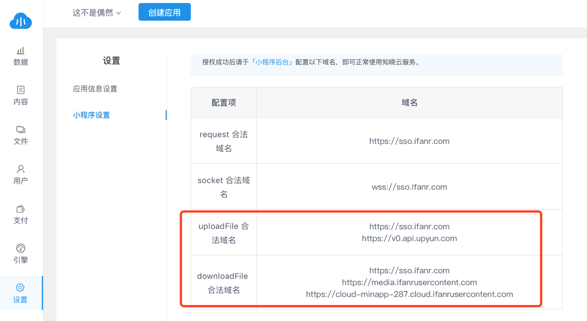
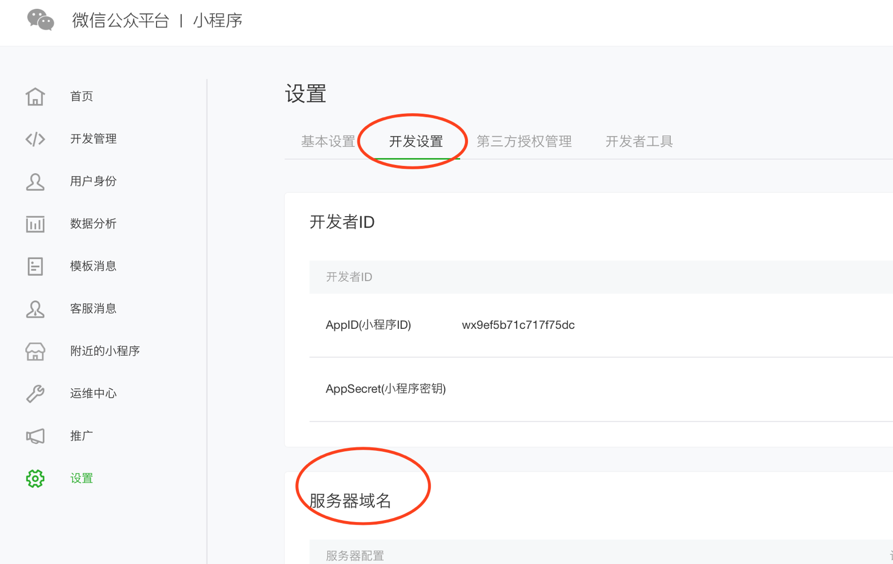
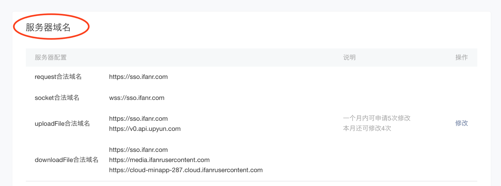

# 常见问题

### 问题索引

* [如何获取AppID?](#appid)
* [如何在微信后台配置安全域名?](#Wechat-config)
* [通过URL对图片进行裁剪缩放等操作](#picAct)
* [Date 格式参数设置](#Date-config)
* [ACL权限管理](#ACL)

##  如何获取AppID?

您可以直接登录小程序后台，进入“设置-开发设置”查看即可

 
## 如何在微信后台配置安全域名?
1.您可以在知晓云后台 – [设置](https://cloud.minapp.com/admin/profile/) – 小程序设置，查看域名配置项

2.登录[微信后台](https://mp.weixin.qq.com/) – 设置 – 开发设置 – 服务器域名，完成配置

3.完成配置后即可正常使用知晓云服务

 
## 如何通过图片URL对图片进行云处理? 
#### 描述
通过 URL 访问图片时，对图片进行处理，并把处理后的图片返回。
#### 格式
图片 URL + 间隔标识符 + 参数
#### 示例
图片URL：`https://p.upyun.com/docs/cloud/demo.jpg`
#### 示例说明
| 间隔标识符    |   功能    |
| :----- | :----- |
| ! | 将格式转换为webp |

即将访问的图片URL：`https://p.upyun.com/docs/cloud/demo.jpg!/format/webp `

###间隔标识符
#### 描述
用于分隔图片 URL 和处理信息，有 3 种可选，分别是：!（感叹号/默认值）、-（中划线）和 _（下划线）。
#### 支持格式
| 类型    |   值    |
| :----- | :----- |
| 输入格式 | JPG、JPEG、PNG、WebP、动态 WebP、GIF、动态 GIF、BMP、SVG等 |
| 输出格式 | JPG、PNG、WebP、动态 WebP |
#### 其他约束
图片宽或高最大不能超过 2 万像素，「宽 * 高 * 帧数」最大不能超过 2 亿。

###图片缩放功能
| 参数    | 值    | 说明   |
| :-------- | :---- | :---- |
| 	`/fw/<width>` | 宽度,如 300 | 限定宽度，高度自适应 |
| 	`/fh/<height>` | 高度,如 200 | 限定宽度，高度自适应 |
| 	`/max/<max>` | 最长边,如   200 | 限定最长边，短边自适应 |
| 	`/min/<min>` | 最短边,如   200 | 限定最短边，长边自适应 |
| 	`/fwfh/<w>x<h>` | 宽度x高度,如 300x200 | 限定宽度或高度，宽高不足时不缩放 |
| 	`/fwfh2/<w>x<h>` | 宽度x高度,如 300x200 | 限定宽度最小值和高度最小值，宽高不足时不缩放|
| 	`/both/<w>x<h>` | 宽度x高度,如 300x200 | 固定宽度和高度，宽高不足时居中裁剪再缩放,特别地，配合 `/force/true` 使用时，宽高不足时只缩放，不裁剪 |
| 	`/sq/<w>` | 宽度或高度,如 300 | 图片缩放成正方形，宽高相等 |
| 	`/scale/<scale>` | 缩放比例，如 50 | 宽高等比例缩放，取值范围 `[1-1000]` |
| 	`/wscale/<wscale>` | 宽度缩放比例，如 200 | 宽度按比例缩放，高度不变，取值范围 `[1-1000]` |
| 	`/hscale/<hscale>` | 高度缩放比例，如 200 | 高度按比例缩放，宽度不变，取值范围 `[1-1000]`  |
| 	`/fxfn/<max>x<min>` | 长边x短边，如 300x200 | 限定长边或短边，进行等比缩放，不裁剪 |
| 	`/fxfn2/<max>x<min>` | 长边x短边，如 300x200 | 限定长边最小值和短边最小值，进行等比缩放，不裁剪 |
| 	`/fp/<integer>` | 宽高像素积，如 200000 | 宽高等比例缩放，直到宽高像素积小于但最接近指定值，取值范围 `[1-25000000]` |
| 	`/force/<boolean>` | 布尔值,true or false | 不支持放大的参数，指定 `/force/` 为 `true` 进行放大，默认 `false` |

注:

* `fwfh` 当原图宽与期望缩放的宽的比例大于原图高与期望缩放的高的比例时，是 `fw`；否则，是 `fh`。
* `scale` 值取 `20` 时，缩小后的图片宽高是原图宽高的 `20%`；取 `200` 时，放大后的图片宽高是原图宽高的 `200%`， 即2倍放大。
* 特别地，大部分参数默认不支持放大，如果需要放大，请指定 `/force/true`。
* `<w>x<h>` 中的 `x` 是 **小写字母 x**，不是乘号。

###图片裁剪功能
| 参数    | 值    | 说明   |
| :-------- | :---- | :---- |
| 	`/crop/<w>x<h>a<x>a<y>` | 	宽x高axay，如 300x200a80a60 | 缩小或放大前进行裁剪 |
| 	`/clip/<w>x<h>a<x>a<y>` | 宽x高axay，如 300x200a80a60 | 缩小或放大后进行裁剪 |
| 	`/gravity/<gravity>` | 位置，如 north | 裁剪开始的方位，默认 `northwest`，详见[方位说明](https://cloud.minapp.com/admin/profile/),特别地，`/gravity` 需要放在 `/crop` 或 `/clip`的后面 |
| 	`/roundrect/<roundrect>` | 圆角半径，如20 |裁剪时对四角进行圆化（圆角裁剪），默认 `10`|

注:

* `<w>x<h>` 中的 x 是**小写字母 x**，不是乘号。当 `<w>x<h>` 是 `0x0` 时，自动根据偏移量计算裁剪图片宽、高。
* `a<x>s<y>` 中的 `<x>、<y>` 表示偏移量，a、s 表示正、负，判断依据如下：

| x / y  |  说明   |
| :-------- | :---- |
| 	x		| 往 `east` 方向偏移，为 `a`,往 `west` 方向偏移，为 `s` |
| 	y	  	| 往 `south` 方向偏移，为 `a`,往 `north` 方向偏移，为 `s`  |

###水印功能
####图片水印
| 参数    | 值    | 说明   |
| :-------- | :---- | :---- |
| 	`/watermark/url/<url>` | 编码字符串，如`L3BhdGgvdG8vd2F0ZXJtYXJrLnBuZw==` | 水印图片的   URI，示例为 `/path/to/watermark.png` 的 Base64 编码字符串。特别地，水印图片必须和待处理图片在同一服务名下 |
| 	`/align/<align>` | 位置，如 north | 水印图片放置方位，，默认 `northwest`，详见[方位说明](https://cloud.minapp.com/admin/profile/)|
| 	`/margin/<x>x<y>` | 横偏移x纵偏移，如 15x10 | 水印图片横纵相对偏移，默认 `20x20` |
| 	`/opacity/<opacity>` | 透明度，如 90 |水印图片透明度，默认 `100`，取值范围 `[0-100]`，值越大越不透明，特别的，0 完全透明，100 完全不透明 |
| 	`/percent/<integer>` | 百分比值，如 50 | 水印图片自适应原图短边的比例，取值范围 `[0-100]`，默认 `0`，表示不设置该参数 |
| 	`/repeat/<boolean>` | 布尔值，true or false | 水印图片是否重复铺满原图，默认为`false`，代表不铺满|
| 	`/animate/<boolean>` | 布尔值，true or false | 允许对动态图片加水印，默认 `false` |

####文字水印
| 参数    | 值    | 说明   |
| :-------- | :---- | :---- |
| 	`/watermark/text/<text>` | 文字内容，如`5L2g5aW977yB ` |文字内容，示例为 `你好！` 的 Base64 编码字符串。 |
| 	`/size/<size>` | 大小，如 16 | 水文字大小，单位 px，默认 `32`|
| 	`/font/` | 字体，如 simsun（宋体） | 文字字体，默认 simsun。字体使用时，需要用参数名。参数名详见[字体列表](https://docs.upyun.com/cloud/image/#font_list) |
| 	`/color/<color>` | 	RGB，如 FF0000（红色） |字体颜色，默认 `000000`（黑色） |
| 	`/border/<border>` | RGBA，如 FF000000（不透明红色） | 文字描边，默认 `FFFFFFFF`（透明白色），详见[链接地址](https://docs.upyun.com/cloud/image/#border) |
| 	`/align/<align>` | 位置，如 north | 文字水印放置方位，，默认 `northwest`，详见[方位说明](https://cloud.minapp.com/admin/profile/)|
| 	`/margin/<x>x<y>` | 横偏移x纵偏移，如 15x10 | 水印横纵相对偏移，默认 `20x20` |
| 	`/opacity/<opacity>` | 透明度，如 90 |水印透明度，默认 `100`，取值范围 `[0-100]`，值越大越不透明，特别的，0 完全透明，100 完全不透明 |
| 	`/animate/<boolean>` | 布尔值，true or false | 允许对动态图片加水印，默认 `false` |

####多个水印
把图片水印或文字水印参数重复，例如，一个文字水印 + 一个图片水印
>/watermark/text/5L2g5aW977yB/font/simhei/watermark/url/L2RvY3MvY2xvdWQvdXB5dW4tbG9nby5wbmc=/align/southeast

## Date 格式参数设置
| 格式    |   描述   |  输出样例   |
| :-------- | :---- | :---- |
| 	a | 'a.m.' or 'p.m.' (Note that this is slightly different than PHP’s output, because this includes periods to match Associated Press style.) |a.m. |
| 	A | 'AM' or 'PM'. | AM |
|b  |  Month, textual, 3 letters, lowercase.  |  'jan' |
|B  |  Not implemented.  |  
|c  |  ISO 8601 format. (Note: unlike others formatters, such as “Z”, “O” or “r”, the “c” formatter will not add timezone offset if value is a naive datetime (see datetime.tzinfo).  |  2008-01-02T10:30:00.000123+02:00, or 2008-01-02T10:30:00.000123 if the datetime is naive|
|d  |  Day of the month, 2 digits with leading zeros.  |  '01' to '31'|
|D  |  Day of the week, textual, 3 letters.  |  'Fri'|
|e  |  Timezone name. Could be in any format, or might return an empty string, depending on the datetime.  |  '', 'GMT', '-500', 'US/Eastern', etc.|
|E  |  Month, locale specific alternative representation usually used for long date representation.  |  'listopada' (for Polish locale, as opposed to 'Listopad')|
|f  |  Time, in 12-hour hours and minutes, with minutes left off if they’re zero. Proprietary extension.  |  '1', '1:30'|
|F  |  Month, textual, long.  |  'January'|
|g  |  Hour, 12-hour format without leading zeros.  |  '1' to '12'|
|G  |  Hour, 24-hour format without leading zeros.  |  '0' to '23'|
|h  |  Hour, 12-hour format.  |  '01' to '12'|
|H  |  Hour, 24-hour format.  |  '00' to '23'|
|i  |  Minutes.  |  '00' to '59'|
|I  |  Daylight Savings Time, whether it’s in effect or not.  |  '1' or '0'|
|j  |  Day of the month without leading zeros.  |  '1' to '31'|
|l  |  Day of the week, textual, long.  |  'Friday'|
|L  |  Boolean for whether it’s a leap year.  |  True or False|
|m  |  Month, 2 digits with leading zeros.  |  '01' to '12'|
|M  |  Month, textual, 3 letters.  |  'Jan'|
|n  |  Month without leading zeros.  |  '1' to '12'|
|N  |  Month abbreviation in Associated Press style. Proprietary extension.  |  'Jan.', 'Feb.', 'March', 'May'|
|o  |  ISO-8601 week-numbering year, corresponding to the ISO-8601 week number (W) which uses leap weeks. See Y for the more common year format.  |  '1999'|
|O  |  Difference to Greenwich time in hours.  |  '+0200'|
|P  |  Time, in 12-hour hours, minutes and ‘a.m.’/’p.m.’, with minutes left off if they’re zero and the special-case strings ‘midnight’ and ‘noon’ if appropriate. Proprietary extension.  |  '1 a.m.', '1:30 p.m.', 'midnight', 'noon', '12:30p.m.'|
|r  |  RFC 5322 formatted date.  |  'Thu, 21 Dec 2000 16:01:07 +0200'|
|s  |  Seconds, 2 digits with leading zeros.  |  '00' to '59'|
|S  |  English ordinal suffix for day of the month, 2 characters.  |  'st', 'nd', 'rd' or 'th'|
|t  |  Number of days in the given month.  |  28 to 31|
|T  |  Time zone of this machine.  |  'EST', 'MDT'|
|u  |  Microseconds.  |  000000 to 999999|
|U  |  Seconds since the Unix Epoch (January 1 1970 00:00:00 UTC).  |  |
|w  |  Day of the week, digits without leading zeros.  |  '0' (Sunday) to '6' (Saturday)|
|W  |  ISO-8601 week number of year, with weeks starting on Monday.  |  1, 53|
|y  |  Year, 2 digits.  |  '99'|
|Y  |  Year, 4 digits.  |  '1999'|
|z  |  Day of the year.  |  0 to 365|
|Z  |  Time zone offset in seconds. The offset for timezones west of UTC is always negative, and for those east of UTC is always positive.  |  -43200 to 43200

 
## ACL权限管理
[ACL](https://en.wikipedia.org/wiki/Access_control_list), 又称访问控制列表，是使用以访问控制矩阵为基础的访问控制方法，每一个对象对应一个串列主体。访问控制表描述每一个对象各自的访问控制，并记录可对此对象进行访问的所有主体对对象的权限。

详细请查看[文档](https://ifanr.gitbooks.io/baas-js-sdk/content/dashboard/page/acl.html)