# 订阅消息实战教程

## 接入订阅消息
开发者可以在[知晓推送页面](https://cloud.minapp.com/dashboard/#/app/wechat-template-message/subscribe-message/)进入订阅消息接入向导：
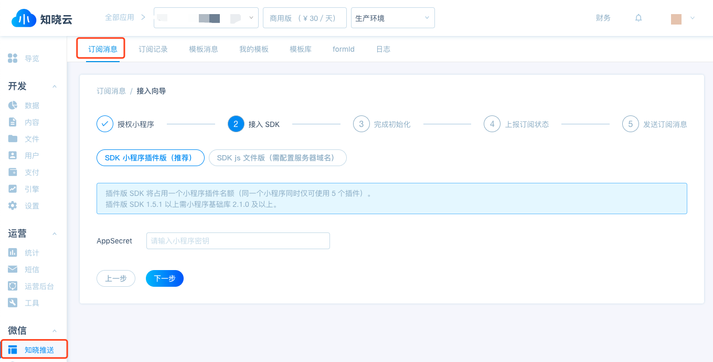

* 前三步与接入微信类似，详情可查看[微信小程序接入](/js-sdk/wechat/how-to.md)，在「接入 SDK」处需要填入 AppScret，AppSecret 用于开通模板消息服务，在小程序后台“设置 - 开发设置”中查看。

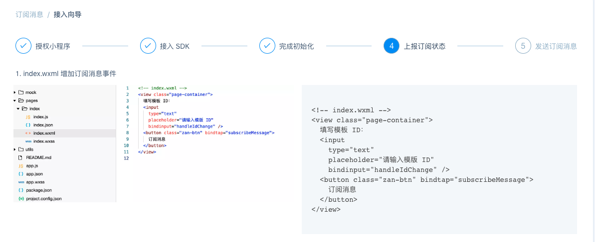

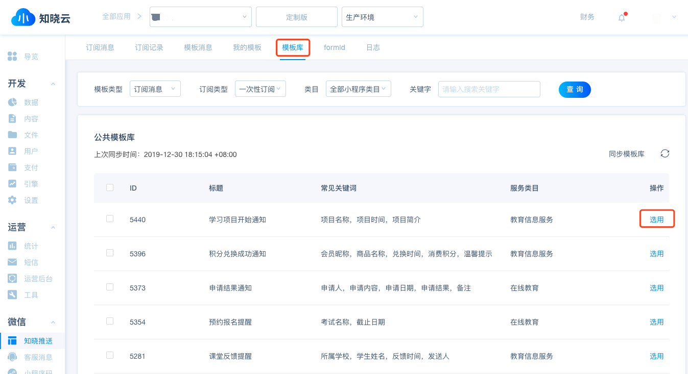

* 根据引导进行上报订阅消息。

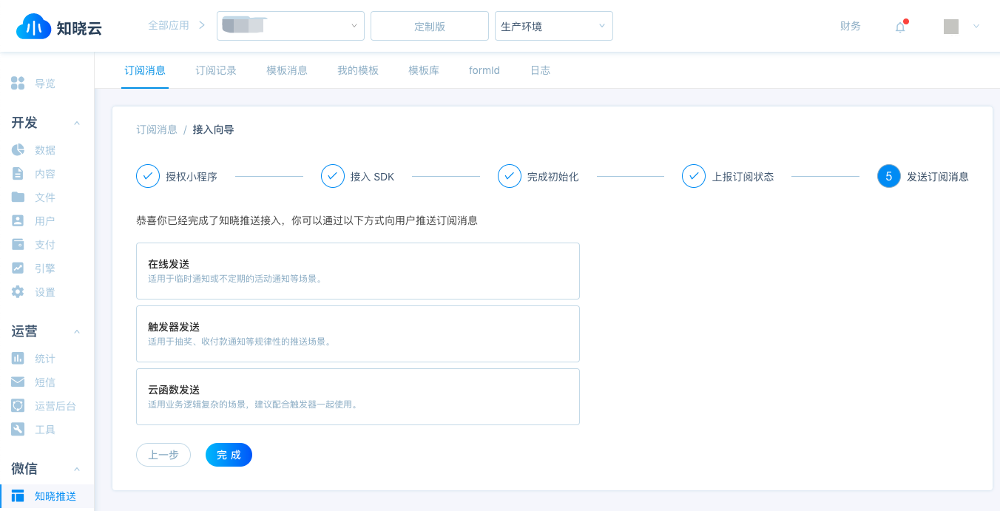

* 通过校验后即完成接入。

## 获取模板 ID
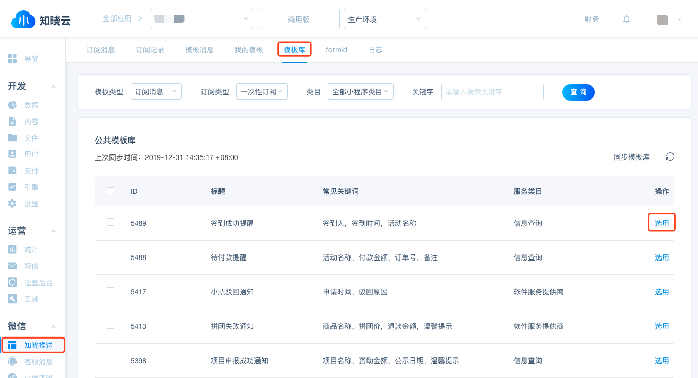

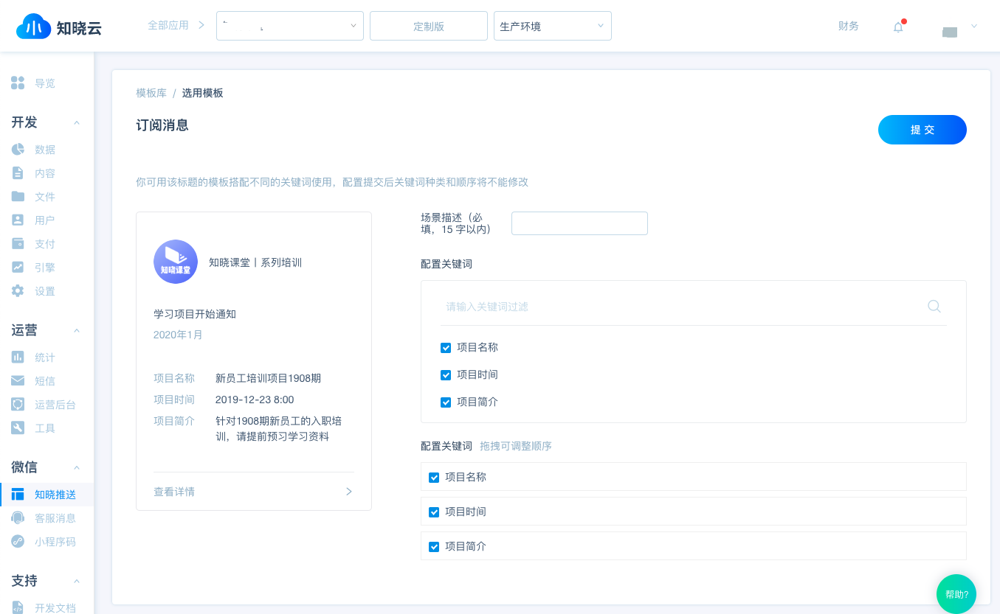

在模板库中搜索合适的模板，点击选用，选择需要的关键词后提交即可完成模板创建。

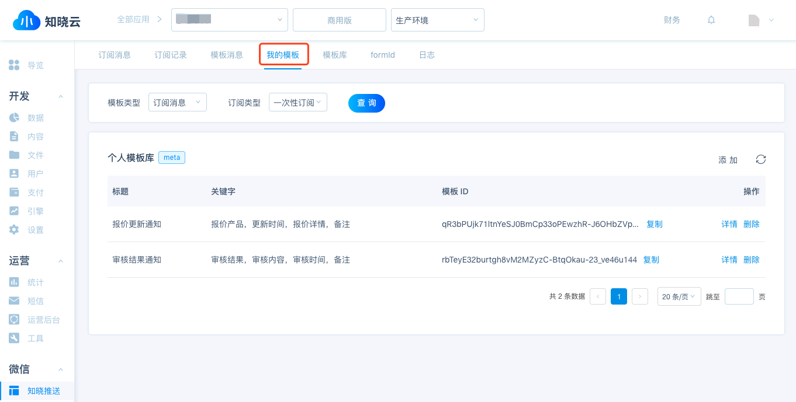

在「我的模板」可以查看、添加和删除模板，在这里获取模板 ID。

## 获取下发权限
微信小程序提供了 [wx.requestSubscribeMessage](https://developers.weixin.qq.com/miniprogram/dev/api/open-api/subscribe-message/wx.requestSubscribeMessage.html) 接口来发起申请订阅权限界面。

### 上报订阅状态的接口
知晓云提供了 [wx.BaaS.subscribeMessage(options)](/js-sdk/wechat/subscribe-message.md) SDK 来进行收集订阅状态。

#### 参数说明
| 参数          | 类型           | 必填    | 说明    |
|--------------|----------------|--------|--------|
| subscription | Subscription[] |是      | 参数列表 |

**Subscription**

| 参数                | 类型           | 必填    | 说明    |
|--------------------|----------------|--------|--------|
| template_id        | String          |是      | 模板 ID |
| subscription_type  | String          |是      | 订阅类型，目前只支持 once（一次性订阅） |

用户发生点击行为或者发起支付回调后，调起订阅消息界面，通过 SDK 上报订阅状态。

### 示例代码

在函数内我们会调用微信 API wx.requestSubscribeMessage 申请发送订阅权限，弹窗出来后，我们会收到 success 回调，当用户在弹窗同意订阅后，即上报订阅结果为 accept ，将订阅的 template_id （模板 ID）和 subscription_type（订阅类型）存入 subscription 数组中，最后在调用 SDK 进行上报即可。

```js
wx.requestSubscribeMessage({
  tmplIds: [this.data.id],
  success: (res) => {
    let subscription = []
    if (res[this.data.id] === 'accept') {
      subscription.push({
        template_id: this.data.id,
        subscription_type: 'once',
      })
    }
    wx.BaaS.subscribeMessage({subscription}).then(res => {
      // success
    }, err => {
      // fail
    })
  },
})
```
* 目前只支持一次性订阅
* 需要上报订阅结果为 accept 的模版 ID

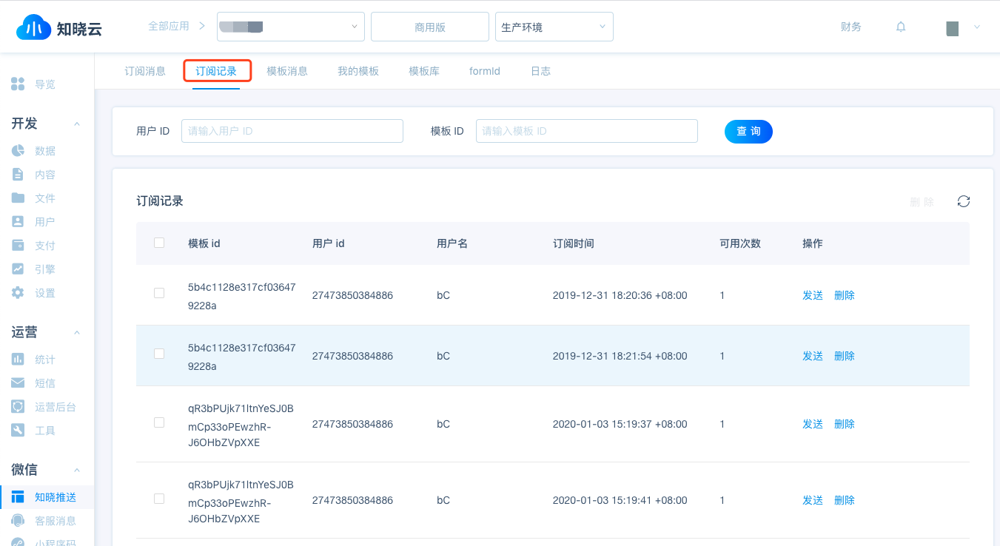

在「订阅记录」查看和操作收集到的订阅记录

## 发送订阅消息
1. 在线发送
2. 通过触发器触发
3. 云函数发送

### 在线发送

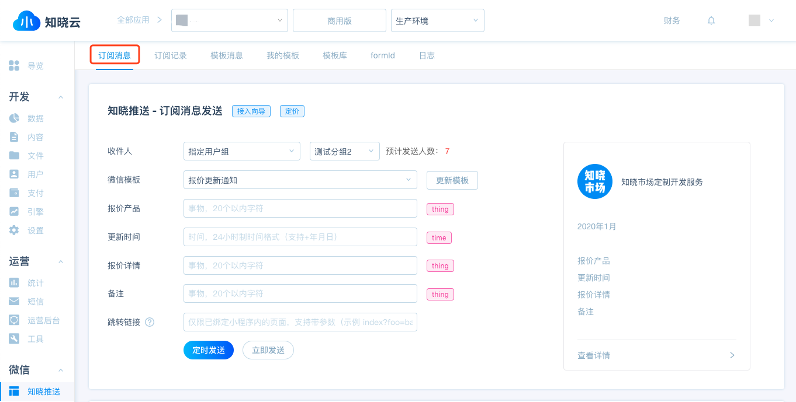

通过在「订阅消息」给用户在线发送订阅消息。填入所需的内容，可以选择立即发送或定时发送。

#### 智能过滤
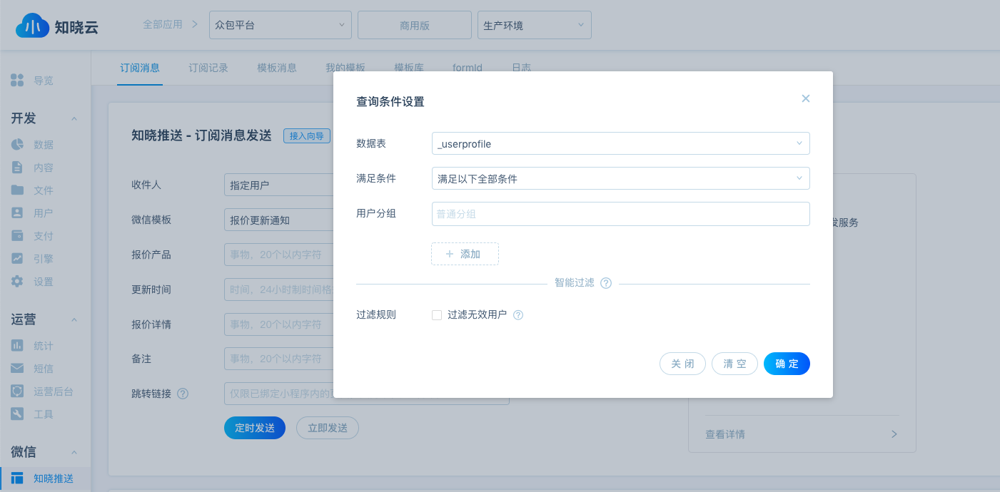

在筛选目标用户时，建议开发者使用智能过滤服务，以保证模板消息的触达率和转化率。

### 通过触发器触发
#### 创建触发器
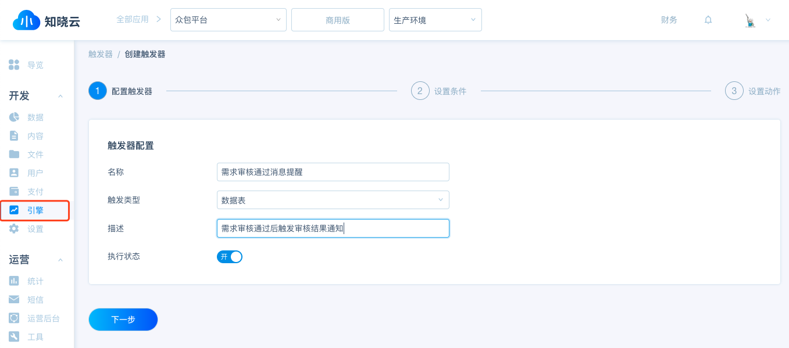
点击「引擎」-「触发器」即可创建新的触发器。

触发类型：即触发源，每个触发器都只能选定一种触发类型，不同的触发类型可执行的动作选项也不一样。

#### 设置条件
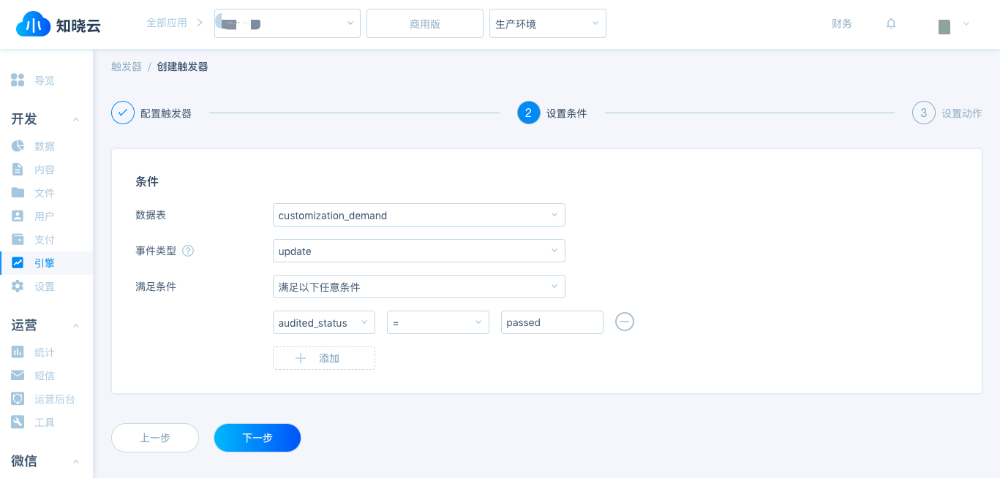

当选定触发类型后，开发者需要指定触发条件来触发后续动作的执行，触发条件与触发类型一一相关，当满足触发条件的时候即可触发该触发器。

#### 设置动作
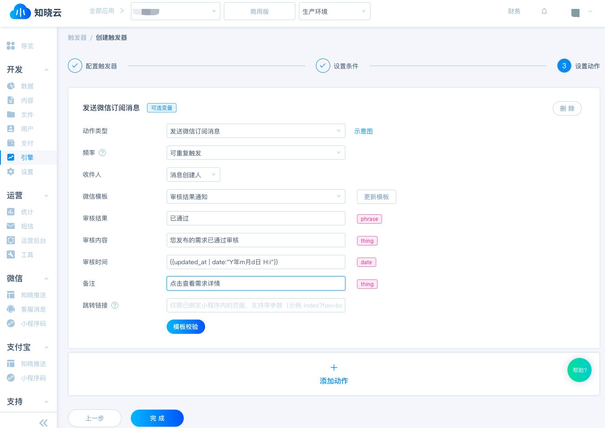

动作类型选择「发送订阅消息」，与在线发送类似，填入相关内容，通过模板校验后即可完成触发器创建。如果所示，updated_at 存的是字符串，可以使用 ```{{updated_at | date:"Y年m月d日 H:i"}}``` 这种 filter 形式进行转换。另外可以点击「添加动作」继续设置动作。

更多内容可查看[知晓云-触发器教程](/dashboard/basic-services/trigger.md)

### 通过云函数发送
#### 创建云函数
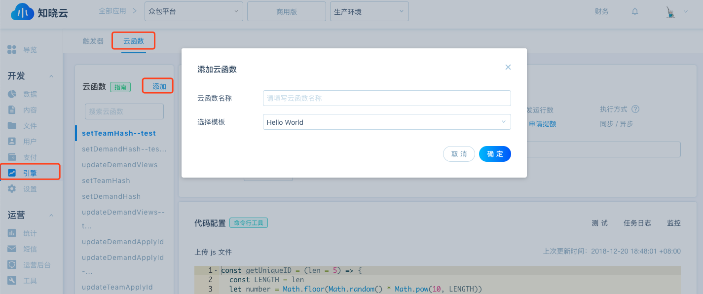

通过「引擎」-「云函数」-「添加」即可完成云函数的创建。

#### 示例代码
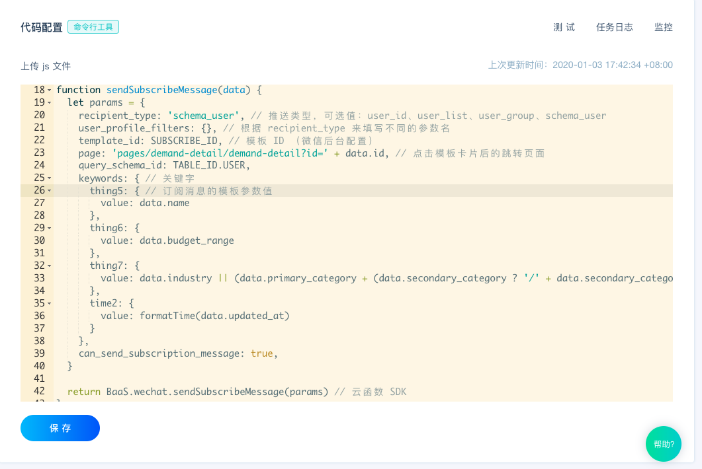

编写完云函数后点击保存即完成云函数的修改。

#### 通过触发器搭配云函数使用
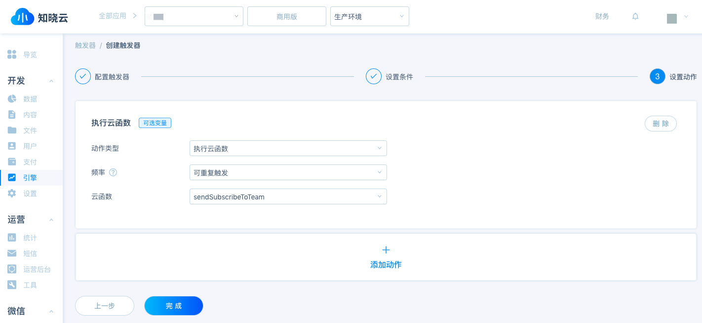

当需要发送的订阅消息逻辑较为复杂时，可以通过编写云函数进行触发。

详情可参考开发文档中的章节《[使用云函数发送订阅消息](/cloud-function/node-sdk/wechat-subscribe-message.md)》

### 注意事项
发送订阅消息必须严格按照[「订阅消息参数值内容限制说明」](https://developers.weixin.qq.com/miniprogram/dev/api-backend/open-api/subscribe-message/subscribeMessage.send.html)来进行填写，「在线发送」以及「触发器」设置动作中已有模板对应的参数值限制。如参数值错误，将导致发送失败，发送详情可在「知晓推送」-「日志」处查看。
