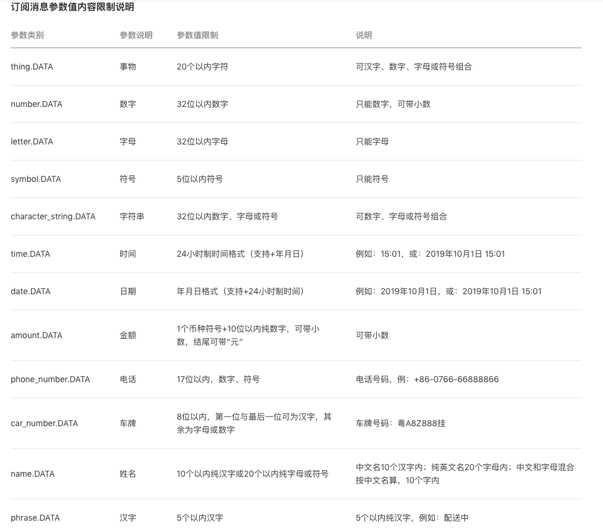

# 订阅消息防坑指南

## 前言
微信官方为提升小程序模板消息的使用体验，调整了模板消息的下发条件。原有的模板消息将升级为「订阅消息」，而模板消息接口于 2020 年 4 月 10 日下线（在 2020 年 1 月 10 日以后新发布的小程序只能使用订阅消息），届时将无法再使用原接口推送模板消息，因此需要开发者及时进行调整。

## 模板消息与订阅消息的区别
无论是模板消息，还是现在新的订阅消息，发送小程序消息都是通过三步完成：

1. 获取模板 ID（即创建模板）
2. 获取下发的权限
3. 发送消息

从步骤来看，只有「获取下发的权限」这一步是有变化的，其余都是相同的。

**模板消息**

当用户在小程序内完成特定的交互行为（支付或提交表单行为）来收集 formid，后续利用该 formid 可以在 7 天内任意时间给该用户推送模板消息。

* 发送模板消息一定要携带 formid
* 推送的有效时间为 7 天
* 用户只能被动选择接收，下发的权利掌握在开发者手上

**订阅消息**

当用户在小程序内点击特定按钮后会弹出申请订阅弹窗，同意后小程序可在后续任意时间给该用户推送服务通知。

* 发送订阅消息需要用户先进行授权
* 授权一次可发送一条服务通知，可以重复授权，每一次授权都会单独保存为一条记录
* 推送时间不受限制
* 用户自主选择接受，下发的权利掌握在用户手上

**小结**
之前的「模板消息」下发是不需要用户授权的，理论上可以设计成用户点击一次就获得一次权限，这个过程中用户是无感知的，只要有了 formid，在公共模板库里有的都能下发，且数据类型没有限制，用户收到什么消息完全取决于开发者。

现在的「订阅消息」更像是一个开关，需要用户主动点击授权之后才能获取下发消息权限，用户接不接收消息，接收什么订阅消息，决定权在用户手里。另外订阅消息还严格控制了数据类型和长度，不符合要求的将无法下发。（血泪教训啊，并且你只有在添加模板之后才能知道这个字段是属于什么类型，对于带变量的模板消息千万要注意变量是否符合字段要求）

## 订阅消息使用场景
「模板消息」与「订阅消息」虽然都是为了召回用户以及推送消息提醒，但由于模板消息推送的时间限制过于严格，相对于一些服务周期较长的小程序来说，7 天的限制不能提供完整的服务。

例如机票类的小程序，用户从订票到出行，这间隔很大可能是超过 7 天的，如果想给用户发送“航班延误提醒”等消息，很有可能是无法实现的。因此，对于低频、长线服务的小程序来说，「订阅消息」是非常重要的。

另外，有少量的小程序会把「模板消息」当成营销工具，用来推送广告，诱导用户点击，这极大影响用户的使用体验。「订阅消息」的上线完美的弥补了这两个问题。

与「模板消息」不同，现在是需要用户授权订阅后才能下发消息，对于刚需的服务场景，例如外卖小程序的“外卖派送消息”以及电商小程序的“到货通知”等场景，订阅率都是比较高的。

而非刚需的服务场景，则可以对用户进行“引导订阅”，所以首先要让用户主动触发订阅。例如，对电商小程序来说，可以引导用户订阅心仪商品的“降价通知”；而内容类小程序，可以引导用户订阅其感兴趣的话题等。

## 升级订阅消息的防坑指南

### 1.调起订阅弹窗
触发用户订阅，微信小程序提供的 api 是：[wx.requestSubscribeMessage](https://developers.weixin.qq.com/miniprogram/dev/api/open-api/subscribe-message/wx.requestSubscribeMessage.html)，触发条件必须是用户点击行为（bindtap 事件）或发起支付回调后才能调起订阅消息界面。像 form 表单的 bindsubmit 事件就不行，如果原先在 form 表单中获取 formid 要升级成订阅消息，这里提供两个思路参考：

* 将 form 表单的 bindsubmit 事件改成 bingtap 事件。手动获取 form 表单的数据，通过 bindtap 事件调起订阅消息界面，完成订阅后再提交表单。（适合表单数据量较少时用）
* 在 bindsubmit 事件中增加引导用户订阅的弹窗。例如，使用 wx.showModal（回调函数是 bindtap 事件），通过用户是否确认来调起订阅消息界面，当完成订阅后再完成表单提交。

### 2.调起订阅弹窗同时跳转页面
当用户点击按钮触发订阅弹窗的时候，同时跳转页面的话，在安卓上是能正常在已跳转的页面显示订阅弹窗，在 iOS 上则不会正常显示，而是在上一个页面显示弹窗。所以从用户体验角度以及为了能正常收集到订阅记录，必须等完成订阅后才进行跳转。

### 3.用户勾选“总是保持以上选择，不再询问”
当用户勾选了“总是保持以上选择，不再询问”时，那么将再也不会唤起这个弹窗。同时，如果选择“取消”，那么以后每次调用这个 api 的时候，都会自动拒绝；如果选择“允许”，则每次都会自动允许授权。

目前，可以使用 wx.getSetting() 来获取用户订阅消息的订阅状态，详情可查看[官方文档](https://developers.weixin.qq.com/miniprogram/dev/api/open-api/setting/wx.getSetting.html)。所需基础版本库为 2.10.0 ，即微信版本 7.0.9 及以上。

在一些特定元素触发申请订阅权限的条件下（比如上述通过 wx.showModal 来唤起订阅界面），可以根据订阅状态来判断是否触发。使用 wx.getSetting() ，可以获取用户是否有勾选“总是保持以上选择，不再询问”以及对该条订阅消息的订阅状态。当 wx.getSetting() 返回用户拒绝订阅该条订阅消息就不显示 wx.showModal 的引导订阅弹窗。

### 4.一次订阅可以收集几条订阅消息？
wx.requestSubscribeMessage 一次调用最多可订阅 3 条消息，即 tmplIds 最多为 3 个。iOS 客户端 7.0.6 版本、Android 客户端 7.0.7 版本之后的一次性订阅/长期订阅才支持多个模板消息，iOS 客户端 7.0.5 版本、Android 客户端 7.0.6 版本之前的一次订阅只支持一个模板消息。详情可看[官方文档](https://developers.weixin.qq.com/miniprogram/dev/api/open-api/subscribe-message/wx.requestSubscribeMessage.html)。

### 5.发送订阅消息的参数限制
发送订阅消息必须严格按照[「订阅消息参数值内容限制说明」](https://developers.weixin.qq.com/miniprogram/dev/api-backend/open-api/subscribe-message/subscribeMessage.send.html)来进行填写。

创建模板的时候，根据选择的关键字不同，在发送订阅消息的时候，需按照上述表格的说明进行填写内容，如不符合参数限制的，则会发送失败。例如，图上的 name.DATA 是10 个以内的纯汉字或 20 个以内的纯字母或符号，如果参数值是 知晓云 2020 则会报 data.name1.value invalid 错误；phrase.DATA 的参数值如果超过 5 个汉字同样是报错。

## 总结
通过以上的防坑指南，可以让小程序开发者少走些弯路，在 deadline 的最后一刻，也能轻松快速完成升级。接下来将通过「知晓推送」，手把手教你如何接入订阅消息。