# 触发器实战教程

## 触发器介绍
我们打开应用的引擎模块，默认就进入到了触发器模块，在这个页面我们可以很方便进行的查询、编辑，禁用等操作。


触发器相关文档请[移步这里](/dashboard/trigger.md)
## 触发类型：数据表
下面我们先以数据表作为触发条件，方便大家实操。

### 邮件模板
#### 准备工作
我们先在数据页面，创建一个product表，然后添加如下一个字段：

| 字段名称 | 类型     |
|------|--------|
| name | string |


#### 创建触发器
我们新建一个触发类型为数据表的触发器，条件卡片的配置如下：

| 名称     | 内容       |
|---------|------------|
| 数据表   | product    |
| 事件类型 | create     |
| 满足条件 | 任一        |
| 条件一   | name = "我的第一件商品"   |


接下来我们编辑邮件内容：

| 名称   | 内容                     |
|------|------------------------|
| 收件人  | test-trigger@ifanr.com |
| 邮件标题 | 您的商品被创建啦               |
| 邮件内容 | 商品{{name}}被创建啦         |

邮件动作填写完成后如下图：
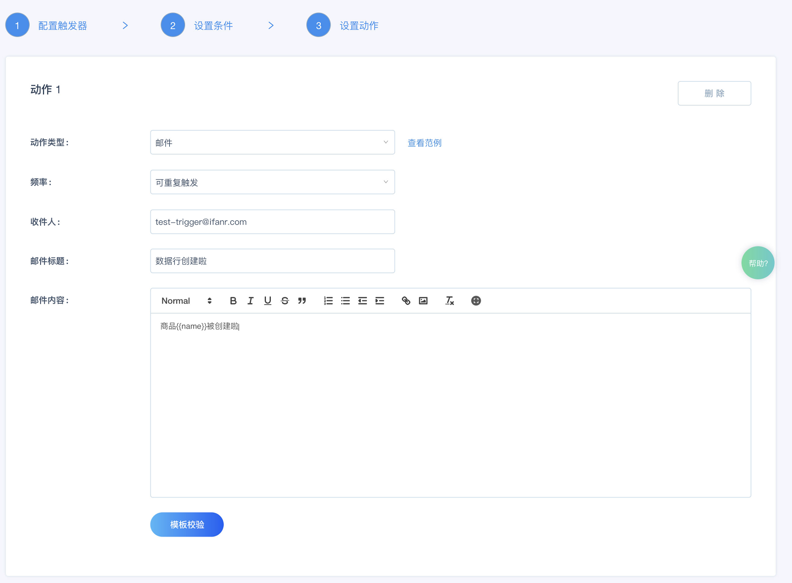

#### 测试触发器
编辑动作完成后点击保存后，我们切换到数据表模块，创建一条数据，name 字段为"我的第一件商品"，如下图：
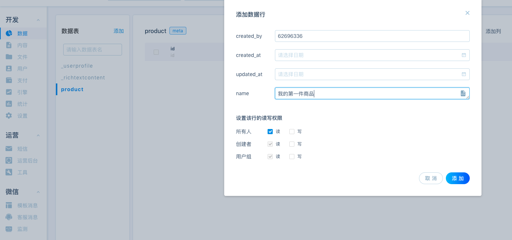

保存后，检查邮箱，发现收到知晓云发来的邮件了
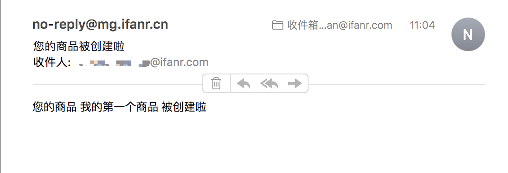

### 微信模板消息

#### 准备工作
1. 了解 BaaS JS SDK 的使用方法。
2. 绑定小程序。去应用设置页面绑定小程序，如果已经绑定可以忽略此步。
3. 获取 appSecret。
4. 在小程序后台选择微信消息模板。
5. 准备一个小程序用于测试。

如果忘记了 appSecret，可以先去微信小程序后台，重置后即可获取 appSecret，如下图：

配置模板消息列表如下图：


#### 创建触发器
我们重新创建一个触发器，这次动作类型选择微信，这时候会出现一个弹窗，要求我们输入小程序的 appSecret，如下图：
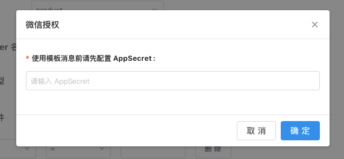

配置 appSecret 完毕后，进入编辑动作页面，填写参数，如下图：
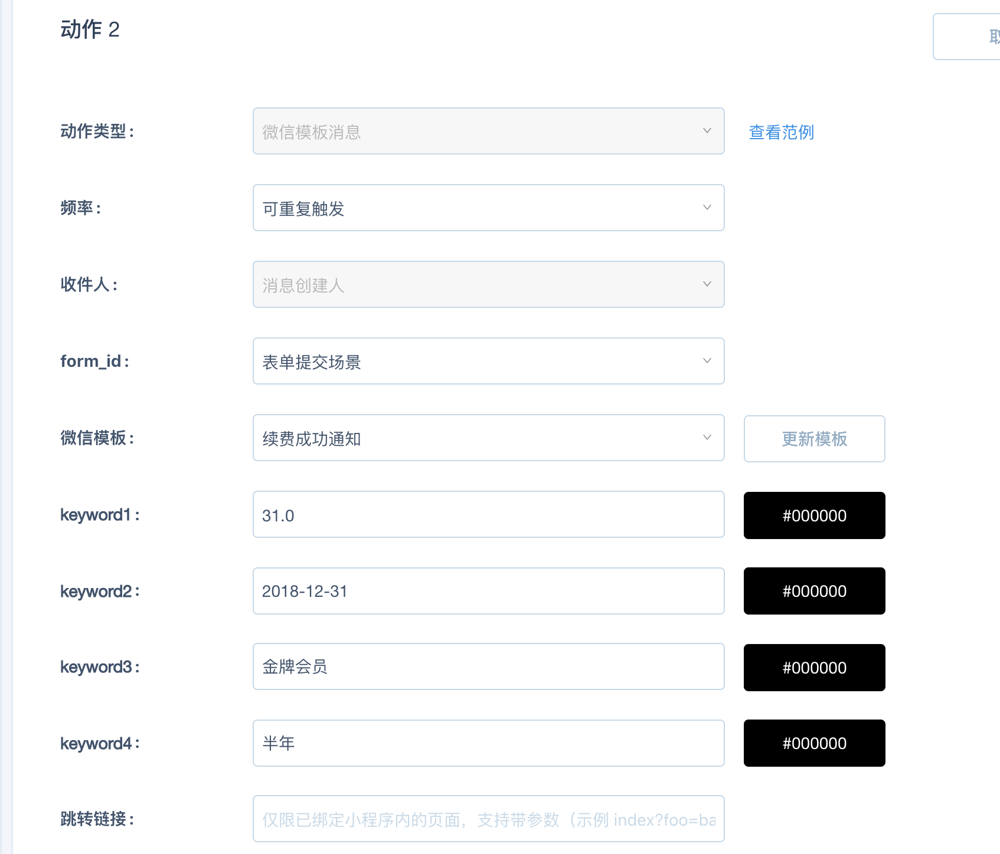

#### 编写小程序代码
保存后，我们打开[微信开发者工具][1]，新建一个小程序项目，开始编写小程序代码。
第一步：在 app.js 引入 [BaaS JS SDK][2]，SDK 文档请[参考这里][3]


第二步：在index.wxml中添加一个form组件，注意这里form组件需要添加 report-submit属性，否则在回调事件对象中无法获取formId。


> **info**
> 发送模板消息必须提前提交 formId

第三步：在index.js文件中添加addProduct回调，保存数据行，同时提交formId。


最后一步，预览小程序，然后点击添加商品，不一会就可以收到微信模板消息了。

### WebHook
#### 准备工作
搭建一个 HTTP 服务器用于接收 POST 请求。这里以 Node.js 为例，写一个简单的 demo：
1. 准备一台具有公网 IP 的服务器。
2. 安装 Node.js 环境。
3. 在当前目录下新建 `index.js`，并将下方代码块内容粘贴至`index.js`。然后执行`npm i koa jsonwebtoken`，安装依赖包。

```js
// index.js
const Koa = require('koa')
const jwt = require('jsonwebtoken')
const app = new Koa()

/**
 * 解析 POST BODY
 * @param ctx
 * @returns {Promise<any>}
 */
function parsePostData(ctx) {
  return new Promise((resolve, reject) => {
    try {
      let postdata = ''
      ctx.req.addListener('data', (data) => {
        postdata += data
      })
      ctx.req.addListener('end', function() {
        let parseData = postdata
        resolve(parseData)
      })
    } catch (err) {
      reject(err)
    }
  })
}

/**
 * 解析 JWT 数据
 * @param str
 * @param secret
 * @returns {Promise<any>}
 */
function decodeJWT(str, secret) {
  return new Promise(function(resolve, reject) {
    if (secret) {
      jwt.verify(str, secret, (err, decoded) => {
        if (err) return reject(err)
        resolve(decoded)
      })
    } else {
      resolve(Buffer.from(str.split('.')[1], 'base64').toString())
    }
  })
}

app.use(async (ctx, next) => {
  let postData = await parsePostData(ctx)
  let data = await decodeJWT(postData, ctx.query.jwt)
  console.log(ctx.header)
  console.log(data)
  ctx.body = 'ok'
})

app.listen(8088, () => {
  console.log('running...')
})
```
执行`node index.js`，启动 HTTP 服务。

#### 创建触发器
我们新建一个触发类型为数据表的触发器，条件卡片的配置如下

| 名称     | 内容       |
|-------- |----------|
| 数据表   | product  |
| 事件类型 | create   |
| 满足条件 | 任一       |
| 条件一   | name = 1 |


我们以数据表`product`为例，在触发器中添加一个 WebHook 动作。


URL 格式如下

```
http://<your ip>:<port>/?jwt=<JWT KEY>
```
示例
```
http://192.168.11.11:8088/?jwt=mehXaWyZXhnzsyWYeUPhWTCOgfjGgdwN
```

####测试触发器
我们在 product 表中创建一行 `name` 字段为 1 的记录，然后在我们搭建的 HTTP 服务器查看输出结果，可以看到我们成功收到了 POST 请求：


> **info**
> 这里为了方便演示，将 JWT KEY 放入了query string 中，生产环境不推荐这么操作。


### 数据表操作
#### 准备工作
1. 新建两张数据表：A 表，B 表。A 表用于激活触发器，然后将结果写入 B 表。
2.  在 A 表新建一个名称为 name，类型为 string 的字段；在 B 表新建一个名称为 result ，类型为 string 的字段。

#### 创建触发器
我们创建一个触发类型为数据表的触发器。
条件卡片如下：

| 名称   | 内容        |
|--------|-----------|
| 数据表  | A         |
| 事件类型 | create    |
| 满足条件 | 任一        |
| 条件一  | name != 1 |


接着我们添加一个数据表操作的动作

| 名称    | 内容                |
|--------|-------------------|
| 动作类型 | 数据表操作             |
| 频率   | 可重复触发             |
| 数据表  | B                 |
| 操作   | 创建                |
| 操作1  | result = {{name}} |


> **info**
> 这里我们使用了模板变量，result = {{name}} 的意思是将数据表 A 中 name 字段赋值给数据表 A 的 result 字段。

#### 测试触发器
我们在数据表 A 中创建一行 name = test123 的记录。
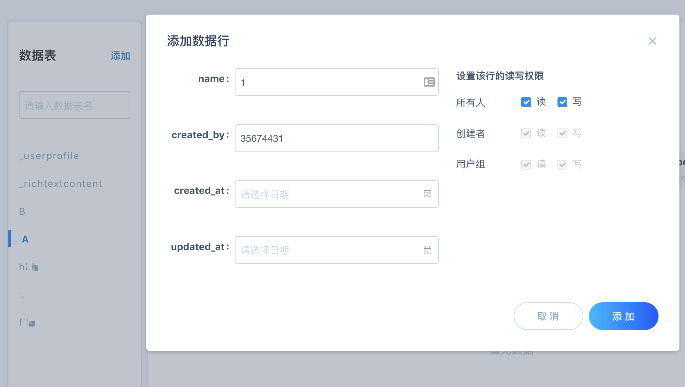
添加成功后，检查数据表 B，发现触发器成功地为我们添加了一行记录
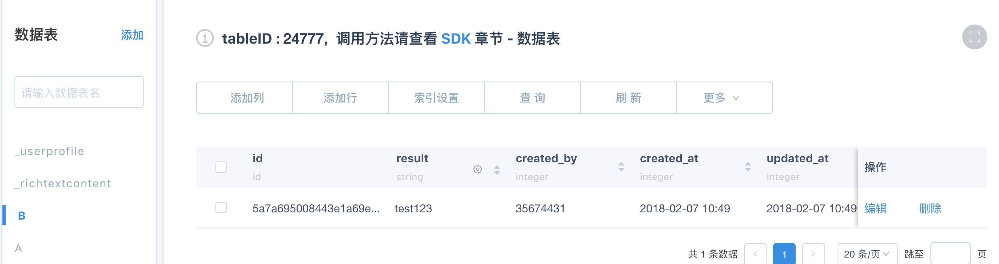

#### 云函数

##### 创建云函数
我们先创建一个云函数，如下图所示：


代码如下：
```js
exports.main = function functionName(event, callback) {
  console.log(event.data)
  callback(null, "hello world")
}
```

##### 创建触发器
我们创建一个触发器，如下图所示
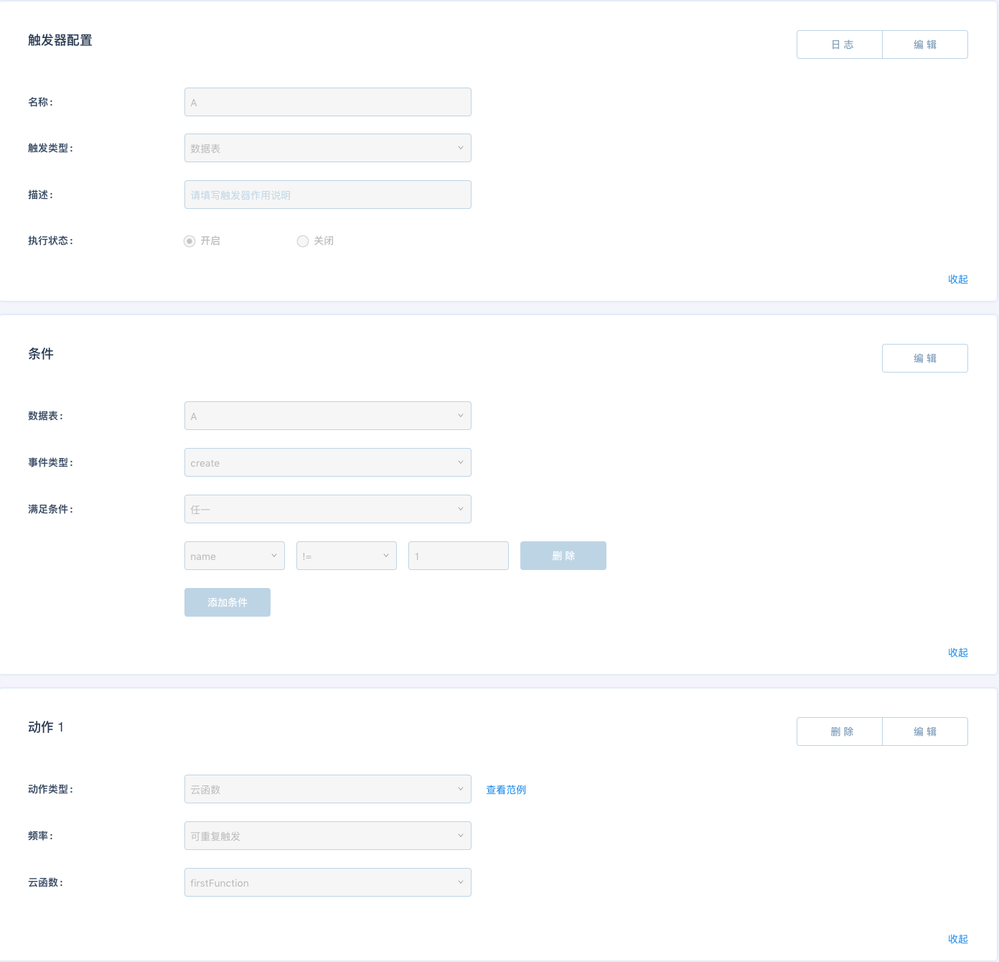

##### 测试触发器
我们在数据表 A 新增一条 name='123' 的记录，稍等几秒后，我们查看下 `firstFunction` 的任务日志
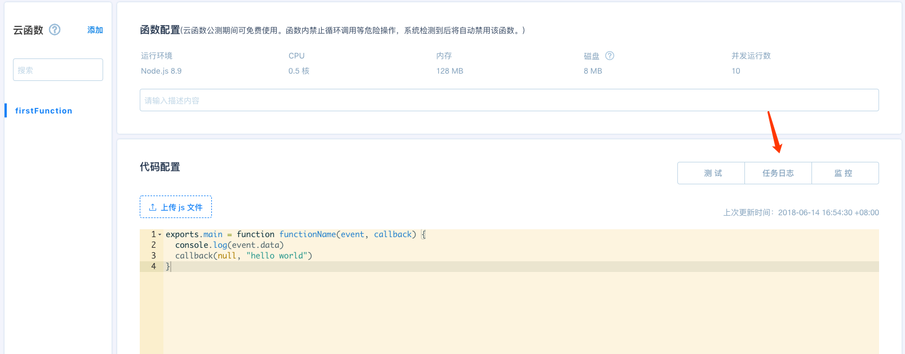

可以看到我们的云函数被成功执行了，event.data 的内容为数据表记录


## 触发类型：微信支付回调
### 准备工作
1. [认证小程序，接入微信支付][4]
2. [在知晓云配置商户号，证书等][5]


我们新建一个小程序，在小程序入口加载 BaaS JS SDK，请求用户授权：代码如下
```javascript
App({
  onLaunch: function () {
    require('./vendor/sdk-v1.4.0.js')
    let clientID = '此处填写 clientID'
    wx.BaaS.init(clientID)

    wx.BaaS.login()
  }
})
```

我们在首页增加一个按钮，在按钮上绑定 click 回调，在回调函数中使用 `wx.BaaS.pay` 来发起支付请求
```javascript
Page({
  pay: function () {
    let params = {
      totalCost: 0.1,
      merchandiseDescription: '一条支付描述'
    }

    wx.BaaS.pay(params).then(res => {
      console.log('pay')
    }, err => {
      // 未完成用户授权或发生网络异常等
      console.log(err)
    })
  }
})
```

支付成功结果：


[下载完整 demo](./sdk-payment-demo.zip)

**下文创建的触发器都是以微信支付回调作为触发类型，相关描述将会被省略**

### 邮件-支付回调
动作创建参照上文创建邮件小节，只是这里我们把邮件相关参数改成如下：

| 名称   | 内容                                     |
|------|----------------------------------------|
| 邮件标题 | 用户支付成功                                 |
| 邮件内容 | 用户支付了{{total_cost}}元， 订单号：{{trade_no}} |


> **info**
> 这里我们使用了 `{{total_cost}}` 模板变量，用于拿到用户支付的具体金额。

随后我们测试微信支付，支付成功后，查看收件箱，如图：


### 微信模板消息-支付回调
动作创建参照上文创建微信模板消息小节。只是这里我们把参数 `keyword1` 改为 `{{total_cost}}`，这样就可以拿到用户支付的具体金额。


> **info**
> 发送模板消息必须提前提交 formId

### WebHook-支付回调
动作创建参照上文创建 WebHook 小节。唯一要注意的是，请求 Body 参数会不同。

### 数据表操作-支付回调
动作创建参照上文创建数据表操作小节。**注意这里可选的模板变量有所不同**。

### 云函数-支付回调

#### 创建云函数
我们创建一个云函数 `verifyPayment`，函数内容如下
```js
exports.main = function functionName(event, callback) {
  console.log(event.data)
  callback(null, '')
}
```

#### 触发云函数
支付成功后，我们查看 `verifyPayment` 的任务日志如下：
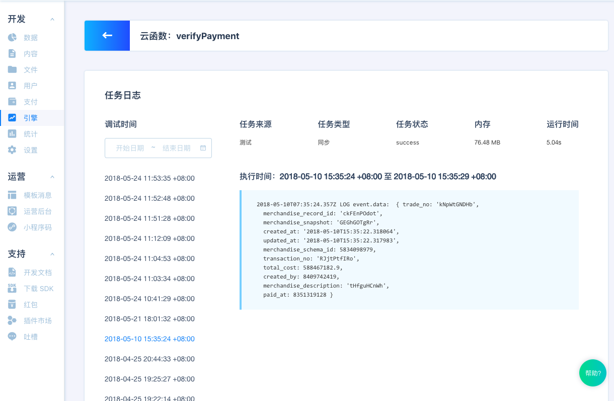

## 触发类型：定时任务

### 准备工作

我们首先创建一个云函数，如下图所示：
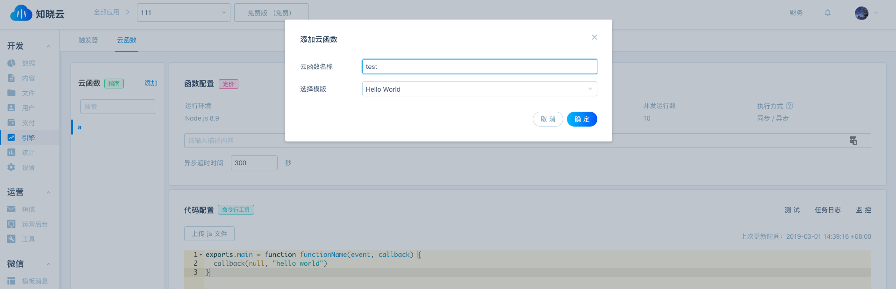

### 创建触发器
我们创建一个触发类型为定时任务的触发器，触发周期为每小时，动作内容选择我们上面创建的云函数。

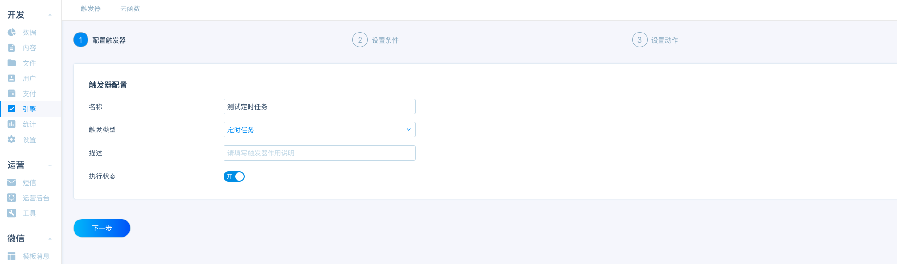
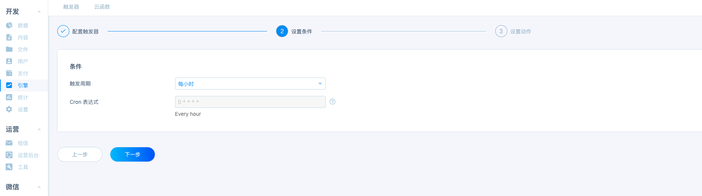
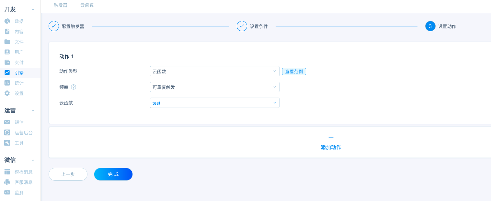

### 测试触发器
过几个小时后，我们查看云函数的任务日志，可以看到云函数被成功执行了
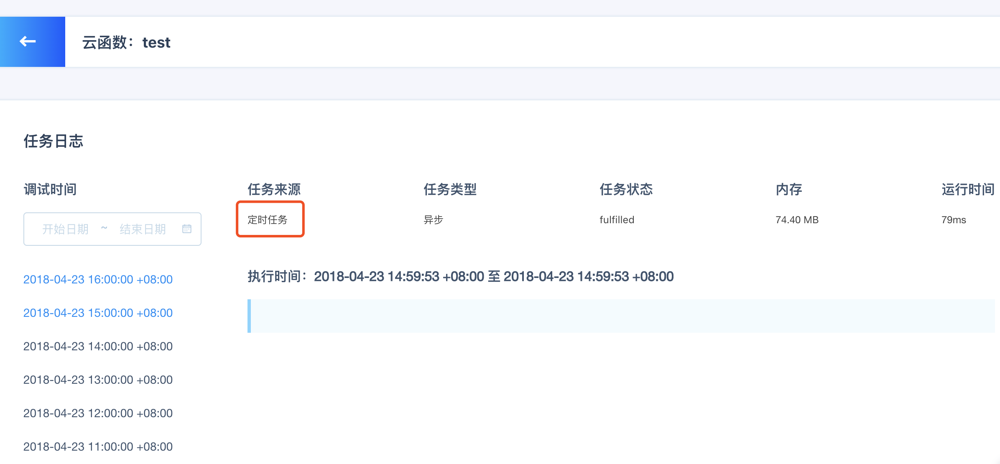

## 触发类型：文件操作

### 准备工作

我们首先创建一个云函数，如下图所示：


### 创建触发器
我们创建一个触发类型为文件操作的触发器，触发条件为上传文件且上传成功，动作内容选择我们上面创建的云函数。

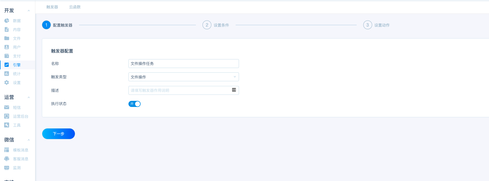
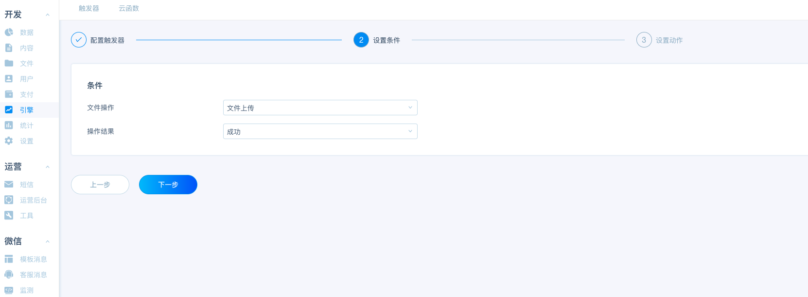


### 测试触发器
我们在控制台中上传一个文件：

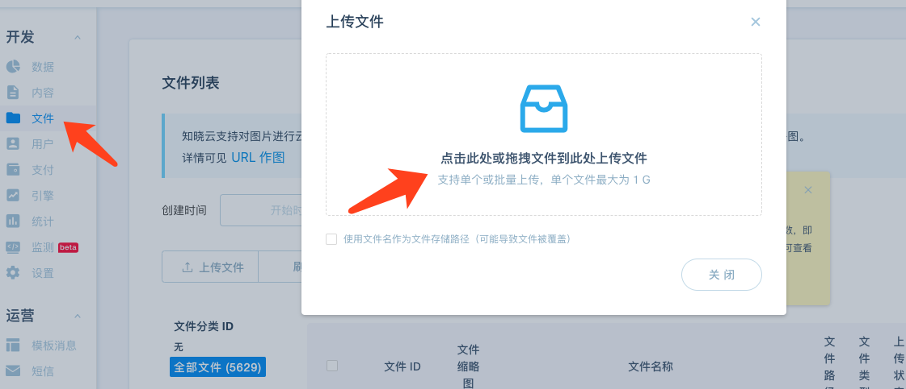

文件上传操作相关文档请[移步这里](../../js-sdk/file/file.md)

之后，我们查看云函数的任务日志，可以看到云函数被成功执行了


## 触发类型：IncomingWebhook

### 准备工作

我们首先创建一个云函数，如下图所示：


### 创建触发器
我们创建一个触发类型为IncomingWebhook的触发器，动作内容选择我们上面创建的云函数。

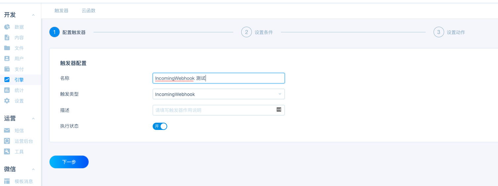
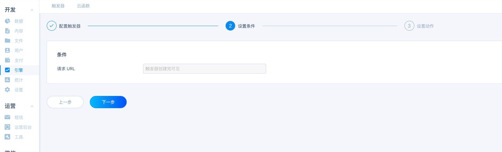


### 测试触发器

在创建好触发器之后，在这里会有一个特定的 URL：
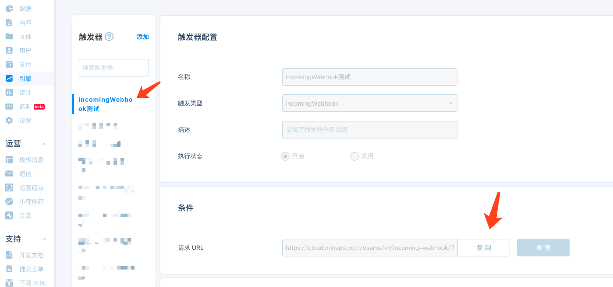

点击复制，然后在新浏览器窗口访问这个 URL：


上面返回了 status: 'ok'; 说明执行成功了。我们查看云函数的任务日志，如下：
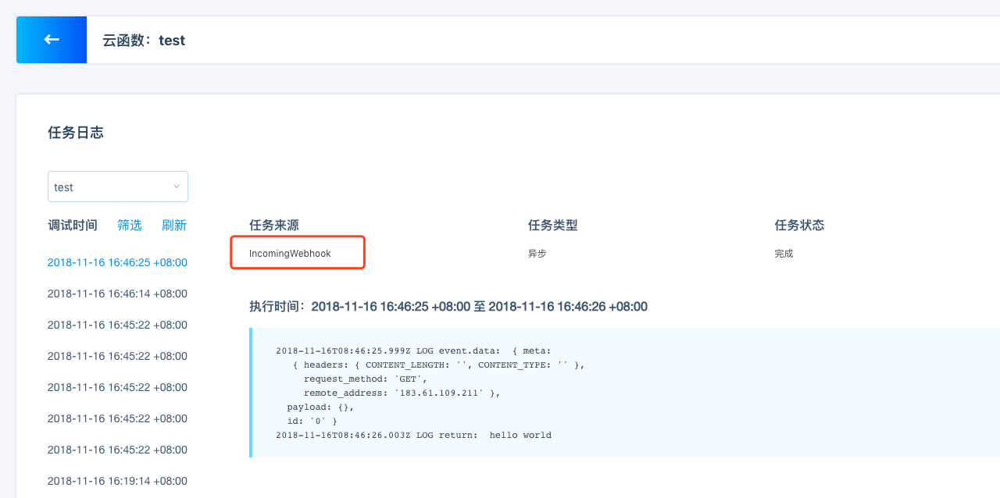

## 触发类型：微信消息推送

### 准备工作

我们首先创建一个云函数，如下图所示：


### 创建触发器
我们创建一个触发类型为微信消息推送的触发器，填入小程序或公众号的 AppID，具体参数值请参考[微信文档][9]，动作内容选择我们上面创建的云函数。

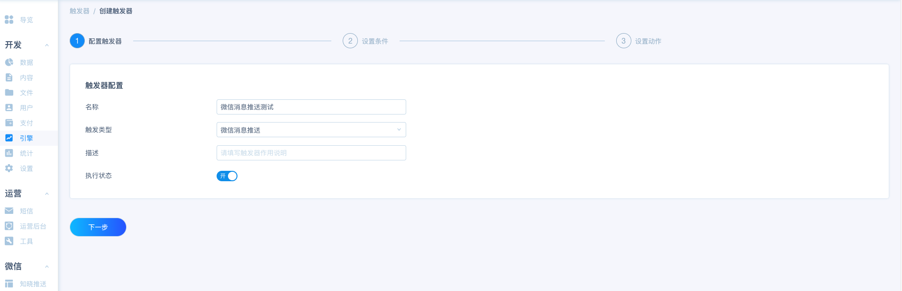
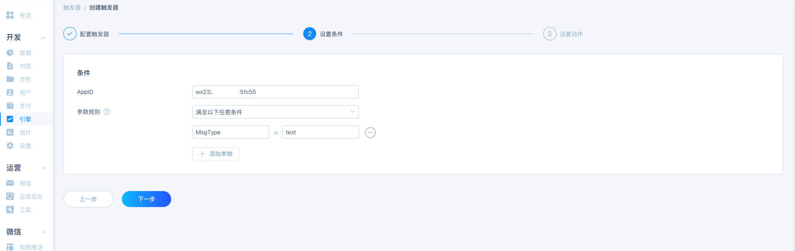
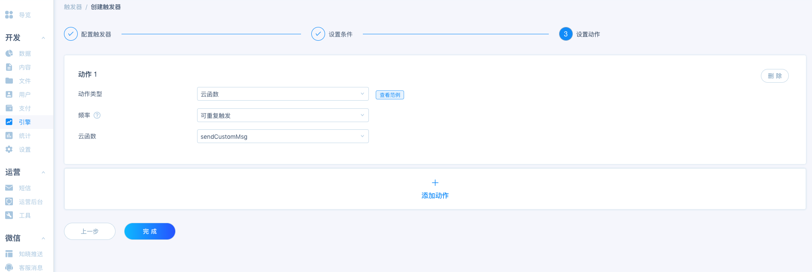

### 测试触发器

我们在小程序页面中添加进入客服消息按钮
```html
<button plain open-type="contact"></button>
```

在小程序页面中点击按钮进入客服会话，并发送文字消息：

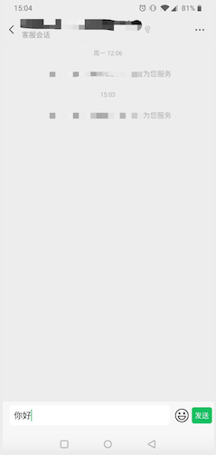

之后，我们查看云函数的任务日志，可以看到云函数被成功执行了：
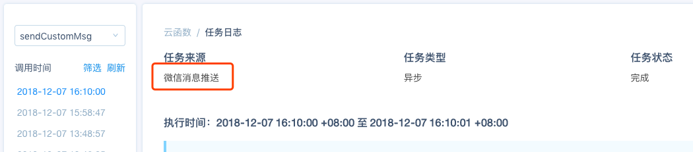

## 触发类型：支付宝支付回调
### 准备工作
1. [认证小程序，接入支付宝支付][10]
2. [在知晓云配置商户号，证书等][5]

### 创建触发器
我们创建一个触发类型为支付宝支付回调的触发器，触发条件为支付成功，触发动作下文只讨论`支付宝模板消息`动作类型，其他动作类型请参考上文微信支付回调。

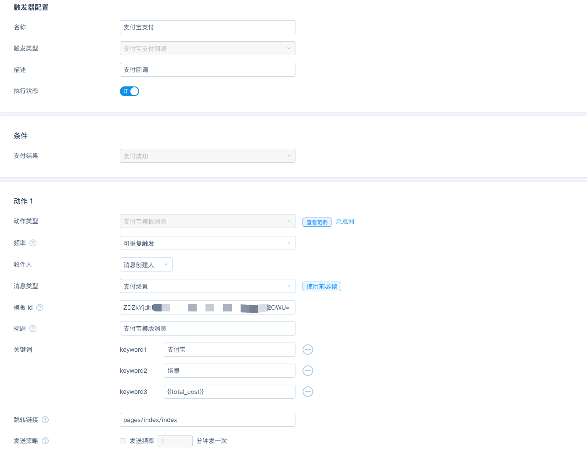

> **info**
> 发送模板消息必须提前提交 formId

### 测试触发器
我们新建一个小程序，在小程序入口加载 BaaS JS SDK，请求用户授权：代码如下
```javascript
App({
  onLaunch: function () {
    require('./vendor/sdk-v2.2.0.js')
    let clientID = '此处填写 clientID'
    my.BaaS.init(clientID)

    my.BaaS.login()
  }
})
```

我们在首页增加一个按钮，在按钮上绑定 click 回调，在回调函数中使用 `my.BaaS.pay` 来发起支付请求
```javascript
Page({
  pay: function () {
    let params = {
      totalCost: 0.01,
      merchandiseDescription: '一条支付描述'
    }

    my.BaaS.pay(params).then(res => {
      console.log('pay')
    }, err => {
      // 未完成用户授权或发生网络异常等
      console.log(err)
    })
  }
})
```

支付成功结果：

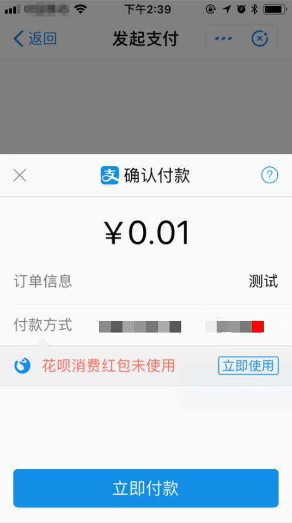
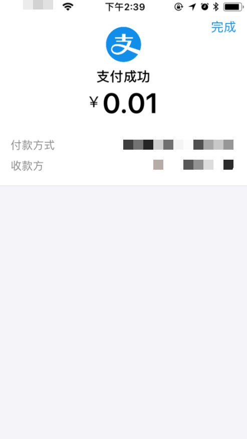

检查触发器日志，调用触发器成功，并成功发送模板消息：

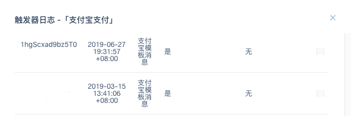


  [1]: https://mp.weixin.qq.com/debug/wxadoc/dev/devtools/download.html
  [2]: https://github.com/ifanrx/hydrogen-js-sdk
  [3]: https://doc.minapp.com/
  [4]: https://mp.weixin.qq.com/debug/wxadoc/introduction/#%E5%B0%8F%E7%A8%8B%E5%BA%8F%E7%94%B3%E8%AF%B7%E5%BE%AE%E4%BF%A1%E6%94%AF%E4%BB%98
  [5]: https://github.com/ifanrx/hydrogen-js-sdk
  [6]: https://doc.minapp.com/payment/pay.html
  [7]: https://github.com/ifanrx/hydrogen-demo/tree/master/payment-demo
  [8]: https://github.com/ifanrx/hydrogen-demo/blob/master/payment-demo/config/config.js
  [9]: https://mp.weixin.qq.com/wiki?t=resource/res_main&id=mp1451025274
  [10]: https://docs.alipay.com/mini/introduce/pay#%E6%8E%A5%E5%85%A5%E6%8C%87%E5%BC%95
